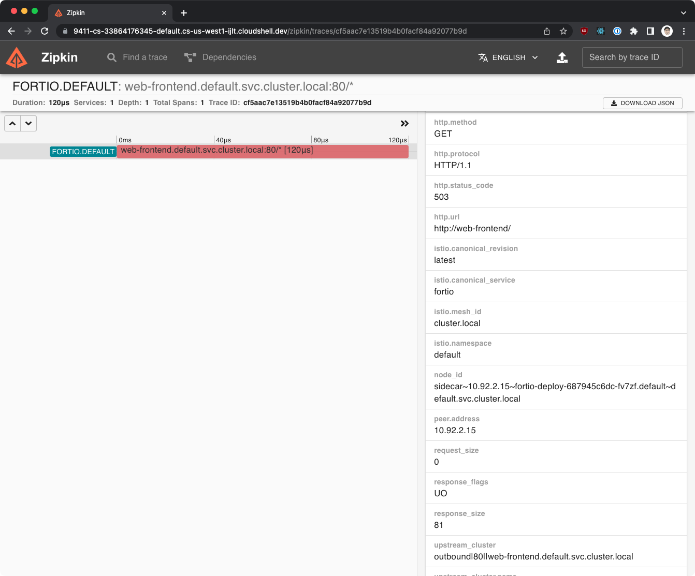
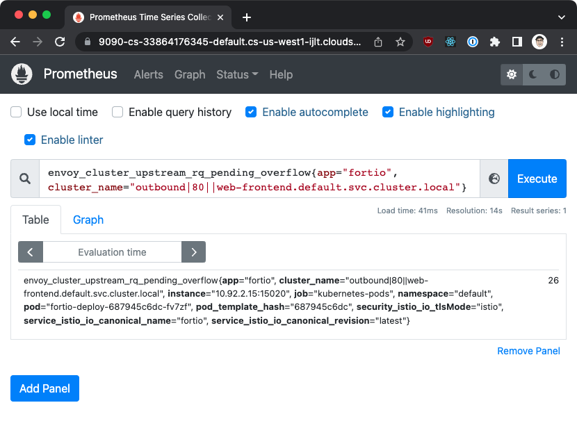

# Circuit breakers

In this lab we'll demonstrate how to configure a circuit breaker and outlier detection using Istio.

## Prerequisites and setup

- Kubernetes with Istio and other tools (Prometheus, Zipkin, Grafana) installed

We'll also have to modify the installation of Istio to enable collection of additional metrics:

```yaml linenums="1" title="istio-metrics.yaml"
--8<-- "circuit-breakers/istio-metrics.yaml"
```

The above will enable collection of metrics for all prefixes in the list and for all workloads in the mesh. Note that this is not recommended for production environments as the number of metrics collected will be very large. Typically, we'd constrain the metrics collection of extra metrics to a specific workload. For example, we could have enabled those metrics on the Fortio deployment we'll use to generate the load, so the metrics would only be collected for that workload.

Save the above to `istio-metrics.yaml` and install Istio using `istioctl install -f istio-metrics.yaml`.

## Deploying the sample application

We'll deploy the `web-frontend` and `customers-v1` workloads with corresponding VirtualServices and the Gateway resource. Make sure you've labeled the default namespace with `istio-injection=enabled` so that the workloads are injected with the Istio sidecar.

??? note "Click for cb-lab.yaml"

    ```yaml linenums="1" title="cb-lab.yaml"
    --8<-- "circuit-breakers/cb-lab.yaml"
    ```
Save the above file to `cb-lab.yaml` and deploy the resources using:

```shell
kubectl apply -f cb-lab.yaml
```

## Circuit breaker - connection pool settings

With services deployed, let's try and generate some load to the `web-frontend` workload and see the distribution of responses.

We'll use Fortio to generate load on the `web-frontend` service - let's deploy Fortio first.

??? note "Click for fortio.yaml"

    ```yaml linenums="1" title="fortio.yaml"
    --8<-- "circuit-breakers/fortio.yaml"
    ```
Save the above file to `fortio.yaml` and deploy it using `kubectl apply -f fortio.yaml`

Let's just make a single request to make sure everything is working:

```shell
export FORTIO_POD=$(kubectl get pods -l app=fortio -o 'jsonpath={.items[0].metadata.name}')
kubectl exec "$FORTIO_POD" -c fortio -- /usr/bin/fortio curl http://web-frontend
```

```console
...
HTTP/1.1 200 OK
x-powered-by: Express
content-type: text/html; charset=utf-8
content-length: 2471
etag: W/"9a7-hEXE7lJW5CDgD+e2FypGgChcgho"
x-envoy-upstream-service-time: 28
server: envoy
```

Let's configure the connection pool settings in the DestinationRule and set the numbers low, so we can trigger the circuit breaker:

```yaml linenums="1" title="cb-web-frontend.yaml"
apiVersion: networking.istio.io/v1alpha3
kind: DestinationRule
metadata:
  name: web-frontend
spec:
  host: web-frontend.default.svc.cluster.local
  trafficPolicy:
    connectionPool:
      http:
        http1MaxPendingRequests: 1 # (1)
        http2MaxRequests: 1 # (2)
        maxRequestsPerConnection: 1 # (3)
```

1. The maximum number of pending HTTP requests to a destination.

2. The maximum number of concurrent requests to a destination.

3. The maximum number of requests per connection.

Here's what the above values represent:

Save the above YAML to `cb-web-frontend.yaml` and apply the changes:

```shell
kubectl apply -f cb-web-frontend.yaml
```

Since all values are set to 1, we won't trigger the circuit breaker if we send the request using one connection and one request per second.

However, if we increase the number of connections and send more requests (i.e. 2 workers sending requests concurrently, and sending 50 requests), we'll start getting errors.

The errors happen because the `http2MaxRequests` is set to 1 and we have more than 1 concurrent request being sent. Additonally, we're exceeding the `maxRequestsPerConnection` limit.

```shell
kubectl exec "$FORTIO_POD" -c fortio -- /usr/bin/fortio load -c 2 -qps 0 -n 50 -loglevel Warning http://web-frontend
```

```console
...
Code 200 : 24 (48.0 %)
Code 503 : 26 (52.0 %)
```

!!! Tip
    To reset the metric counters, run `kubectl exec $FORTIO_POD -c istio-proxy -- curl -X POST localhost:15000/reset_counters`

If we open Zipkin (`istioctl dash zipkin`) and look at the errors, we'll see that the requests are failing because the circuit breaker is tripped (response flags are set to `UO` and status code to 503).

Once you open Zipkin yo ucan click the **Run Query** button and pick one of the failing traces to see the details. You can identify the failing trace by looking at the number of spans - the failing trace will have 1 spans, while the successful ones will have 4 spans.



Another option is looking at the Prometheus metrics directly. Open the Prometheus dashboard using `istioctl dash prometheus` and look for the following metric:

```promql
envoy_cluster_upstream_rq_pending_overflow{app="fortio", cluster_name="outbound|80||web-frontend.default.svc.cluster.local"}
```

The query shows the metrics for requests originating from the fortio app and going to the `web-frontend` service.



Alternatively, we can look at the metrics directly from the `istio-proxy` container in the Fortio Pod:

```shell
kubectl exec "$FORTIO_POD" -c istio-proxy -- pilot-agent request GET stats | grep web-frontend | grep pending
```

```console
cluster.outbound|80||web-frontend.default.svc.cluster.local.circuit_breakers.default.remaining_pending: 1
cluster.outbound|80||web-frontend.default.svc.cluster.local.circuit_breakers.default.rq_pending_open: 0
cluster.outbound|80||web-frontend.default.svc.cluster.local.circuit_breakers.high.rq_pending_open: 0
cluster.outbound|80||web-frontend.default.svc.cluster.local.upstream_rq_pending_active: 0
cluster.outbound|80||web-frontend.default.svc.cluster.local.upstream_rq_pending_failure_eject: 0
cluster.outbound|80||web-frontend.default.svc.cluster.local.upstream_rq_pending_overflow: 26
cluster.outbound|80||web-frontend.default.svc.cluster.local.upstream_rq_pending_total: 24
```

To resolve these errors, we can adjust the circuit breaker settings. We can increase the maximum number of concurrent requests to 2 (`http2MaxRequests`):

```yaml linenums="1" hl_lines="11"
apiVersion: networking.istio.io/v1alpha3
kind: DestinationRule
metadata:
  name: web-frontend
spec:
  host: web-frontend.default.svc.cluster.local
  trafficPolicy:
    connectionPool:
      http:
        http1MaxPendingRequests: 1
        http2MaxRequests: 2
        maxRequestsPerConnection: 1
```

Save the above YAML to `cb-web-frontend.yaml` and apply the changes:

```shell
kubectl apply -f cb-web-frontend.yaml
```

If we re-run Fortio with the same parameters, we'll notice less failures this time:

```shell
kubectl exec "$FORTIO_POD" -c fortio -- /usr/bin/fortio load -c 2 -qps 0 -n 50 -loglevel Warning http://web-frontend
```

```console
...
Code 200 : 39 (78.0 %)
Code 503 : 11 (22.0 %)
```

Since we're sending more than 1 request per connection, we can increase the `maxRequestsPerConnection` to 2:

```yaml linenums="1" hl_lines="12"
apiVersion: networking.istio.io/v1alpha3
kind: DestinationRule
metadata:
  name: web-frontend
spec:
  host: web-frontend.default.svc.cluster.local
  trafficPolicy:
    connectionPool:
      http:
        http1MaxPendingRequests: 1
        http2MaxRequests: 2
        maxRequestsPerConnection: 2
```

Save the above YAML to `cb-web-frontend.yaml` and apply the changes:

```shell
kubectl apply -f cb-web-frontend.yaml
```

If we re-run Fortio this time, we'll get zero or close to zero HTTP 503 reponses. Even if we increase the number of requests per second, we should only get a small number of 503 responses. To get rid of the remaining failing requests, we can increase the `http1MaxPendingRequests` to 2:

```yaml linenums="1" hl_lines="10"
apiVersion: networking.istio.io/v1alpha3
kind: DestinationRule
metadata:
  name: web-frontend
spec:
  host: web-frontend.default.svc.cluster.local
  trafficPolicy:
    connectionPool:
      http:
        http1MaxPendingRequests: 2
        http2MaxRequests: 2
        maxRequestsPerConnection: 2
```

With these settings (assuming 2 concurrent connections), we can easily handle a higher number of requests. Note that the numbers we used in settings are just examples and are not realistic - we set them intentionally low to make the circuit breaker easier to trip.

Before continuing, delete the DestinationRule:

```shell
kubectl delete dr --all
```

## Outlier detection

The circuit breaker is great when we want to protect the services from a sudden burst of requests. However, how can we protect the services in case of failures?

For example, if we have a service that is still failing after multiple requests, it doesn't make sense to send even more requests to it. Instead, we can remove the instance of the failing service from the load balancing pool for a certain period of time. That way, we know that the requests will go to other instances of the service. After a pre-defined period of time, we can bring the failing service back into the load balancing pool.

This process is called outlier detection. Just like in the connection pool settings, we can configure outlier detection in the DestinationRule.

To see the outlier detection in action we need a service that is failing. We'll create a `web-frontend-failing` deployment and configure it to return HTTP 503 responses:

??? note "Click for web-frontend-failing.yaml"

    ```yaml linenums="1" title="web-frontend-failing.yaml"
    --8<-- "circuit-breakers/web-frontend-failing.yaml"
    ```

Save the above YAML to `web-frontend-failing.yaml` and apply it to the cluster with `kubectl apply -f web-frontend-failing.yaml`.

If we run Fortio we'll see that majority of the requests will be failing. That's because the `web-frontend-failing` deployment has more replicas than the "good" deployment.

```shell
kubectl exec "$FORTIO_POD" -c fortio -- /usr/bin/fortio load -c 2 -qps 0 -n 50 -loglevel Warning http://web-frontend
```

```console
...
Code 200 : 9 (18.0 %)
Code 500 : 41 (82.0 %)
```

Let's look at an example of outlier detection configuration:

```yaml
apiVersion: networking.istio.io/v1alpha3
kind: DestinationRule
metadata:
  name: web-frontend
spec:
  host: web-frontend.default.svc.cluster.local
  trafficPolicy:
    outlierDetection:
      consecutive5xxErrors: 1 # (1)
      interval: 5s # (2)
      baseEjectionTime: 60s # (3)
      maxEjectionPercent: 100 # (4)
```

1. Number of 5xx errors in a row that will trigger the outlier detection. 
2. The interval at which the hosts are checked whether they need to be ejected.
3. The duration of time an outlier is ejected from the load balancing pool. If the same host is ejected multiple times, the ejection time increases by multiplying the base ejection time by the number of times the host is ejected.
4. The maximum percentage of hosts that can be ejected.

Save the YAML to `outlier-web-frontend.yaml` and apply it:

```shell
kubectl apply -f outlier-web-frontend.yaml
```

If we repeat the test, we might get a similar distribution of responses the first time, however, if we repeat the command again (once the outliers were kicked out), we'll get a much better distribution:

```shell
kubectl exec "$FORTIO_POD" -c fortio -- /usr/bin/fortio load -c 2 -qps 0 -n 50 -loglevel Warning http://web-frontend
```

```console
...
Code 200 : 50 (100.0 %)
```

The reason for more HTTP 200 responses is because as soon as the failing hosts were ejected (failing Pods from the `web-frontend-failing` deployment), the requests were sent to the other host that doesn't fail. If we'd wait for a while (the 60s `baseEjectionTime`), the failing hosts would be brought back into the load balancing pool and we'd get a similar distribution of responses as before (majority of them failing).

We can also look at the metrics from the outlier detection in the same way we did for the circuit breakers:

```shell
$ kubectl exec "$FORTIO_POD" -c istio-proxy -- pilot-agent request GET stats | grep web-frontend | grep ejections_total
cluster.outbound|80||web-frontend.default.svc.cluster.local.outlier_detection.ejections_total: 4
```

??? Note
    Other metrics that we can look at are `ejections_consecutive_5xx`,  `ejections_enforced_total` or any other metric with the `outlier_detection` in the name. You can find the full list of metric names and there descriptions in the [Envoy documentation](https://www.envoyproxy.io/docs/envoy/latest/configuration/upstream/cluster_manager/cluster_stats#config-cluster-manager-cluster-stats-outlier-detection).

## Cleanup

To clean up all resources, run:

```shell
kubectl delete -f web-frontend-failing.yaml
kubectl delete -f cb-lab.yaml
kubectl delete -f fortio.yaml
kubectl delete dr --all
kubectl delete vs --all
kubectl delete gateway --all
```